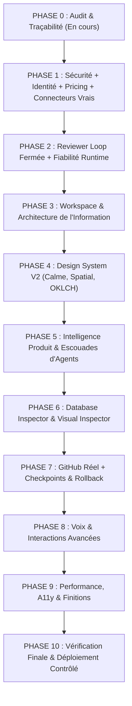

# 🌌 IDEALY — AUDIT TECHNIQUE & PRODUIT INTÉGRAL (PHASE 0)

> **Date d'exécution** : 30 septembre 2026  
> **Branche de référence** : `feat/idealy-live-backend`  
> **Commit de base** : `56a285b0258c3609ff26ca9bee5e4b7f9085d0c7`  
> **Méthode** : Analyse chirurgicale statique, inspection de schéma, tests contractuels réels, audit de sécurité et cartographie des dépendances.

---

## 1. Synthèse Exécutive

Idealy Studio possède une architecture hybride très avancée et déjà hautement structurée :
- Un moteur d'orchestration multi-agents persistant (`orchestrate-mission` / `process-ai-request`) avec VFS structuré (Virtual File System) en NDJSON, calcul de sha256 checksum et persistance dans `mission_files` et `mission_file_events`.
- Un système de gamification et d'allocation de puissance (**Power V2**) formalisé (100 / 1 000 / 3 000 points) par Voies (Ninja, Mage, Hunter, Pro) avec clés d'idempotence et journal append-only.
- Un pont d'authentification tripartite : **NextAuth v5 beta** (session JWT client/serveur), **Supabase GoTrue** (droits RLS pour Edge Functions et RPCs) et **Firebase Web Auth** (Google Sign-In).
- Un **Design Engine** puissant (`lib/idealy/design-engine`) capable d'inférer la plateforme, le framework, la densité, les composants (Shadcn, Lucide, Recharts, Motion, Three.js) et d'appliquer un Design Critic.

Cependant, l'audit révèle des **incohérences de surface, des régressions contractuelles et des failles fonctionnelles** qu'il est indispensable d'assainir avant toute évolution.

---

## 2. Grille d'Évaluation des Sous-Systèmes

Chaque système est audité selon les 8 critères obligatoires :
- **EXISTS** : Le code source existe dans le repository.
- **INTEGRATED** : Les liaisons avec les autres modules sont connectées.
- **EXECUTABLE** : Le code peut s'exécuter sans erreur syntaxique/environnementale.
- **VERIFIED** : Des tests unitaires ou contractuels valident son comportement.
- **SECURE** : Respecte le principe de moindre privilège, pas de fuite de secret ni d'IDOR.
- **COHERENT** : Pas de contradiction avec les autres couches du produit.
- **USABLE** : L'utilisateur final peut l'utiliser via l'interface.
- **PRODUCTION-READY** : Prêt pour des utilisateurs payants réels.

Codes d'état :
- `[A]` **MISSING** : N'existe pas
- `[B]` **INCOMPLETE** : Partiellement implémenté
- `[C]` **INVISIBLE** : Existe côté backend mais absent de l'UI
- `[D]` **DECEPTIVE** : L'interface simule ou promet un état non réel
- `[E]` **BROKEN** : Cassé ou assert en échec
- `[F]` **DUPLICATED** : Implémentations concurrentes
- `[G]` **LEGACY** : Code hérité obsolète

---

## 3. Matrice d'Audit Systémique

| Domaine / Système | Statut | Exists | Integ. | Exec. | Verif. | Secure | Coher. | Usable | Prod-Ready | Diagnostic Factuel |
|---|:---:|:---:|:---:|:---:|:---:|:---:|:---:|:---:|:---:|---|
| **Auth — Identité Canonique** | `[E, F]` | Oui | Partiel | Oui | Non | Non | Non | Oui | Non | Fragmentation entre NextAuth, Supabase et Firebase. Usurpation de compte possible sur login Firebase (`test-firebase-auth.mjs` échoue sur `An identical email is not proof of ownership`). |
| **Auth — Sessions & Tokens** | `[B]` | Oui | Oui | Oui | Oui | Partiel | Oui | Oui | Non | JWT Supabase véhiculé dans le cookie de session NextAuth avec rafraîchissement automatique à -60s. Tolérance de 5 min sur Firebase. |
| **Database — Supabase RLS** | `[B]` | Oui | Oui | Oui | Oui | Oui | Partiel | N/A | Oui | 13 migrations ordonnées. Tables `missions`, `mission_files`, `power_wallets`, `power_transactions` sous RLS stricte. `schema.sql` racine incomplet et désynchronisé des migrations. |
| **Database — Drizzle Local** | `[F, G]` | Oui | Partiel | Oui | Partiel | Oui | Non | Non | Non | `lib/db/schema.ts` déclare des tables `User`, `Chat`, `Message_v2`, `Document`. Concurrent de Supabase pour l'historique de chat. |
| **Système Power V2** | `[E, B]` | Oui | Oui | Oui | Oui | Non | Partiel | Oui | Non | Tables et RPC OK. Mais `app/api/idealy/power/route.ts` retourne `plan: "pro", canExecute: true` si la RPC Supabase échoue (Faille de sécurité). Pas de réservation avant run. |
| **Voies & Escouades** | `[B, D]` | Oui | Oui | Oui | Oui | Oui | Non | Oui | Non | Catalogue des 4 Voies exhaustif avec avatars et statistiques. MAIS `app/(chat)/api/chat/route.ts:568` force `way: "professional"` à la création de mission, ignorant la voie utilisateur. |
| **Orchestration Multi-Agents** | `[B]` | Oui | Oui | Oui | Oui | Oui | Oui | Oui | Non | Exécution séquentielle Architecte → Builder → Reviewer via `orchestrate-mission`. Mais délais artificiels de 3.2s et pas de boucle de rétroaction fermée en cas d'échec Reviewer. |
| **Reviewer Loop** | `[B]` | Oui | Partiel | Oui | Non | Oui | Non | Non | Non | Le Reviewer émet un rapport et bascule la mission en `needs-fix`, mais aucune boucle de correction automatique ciblée vers le Builder n'est implémentée. |
| **Virtual File System (VFS)** | `[B]` | Oui | Oui | Oui | Oui | Oui | Oui | Oui | Oui | Flux NDJSON `file_started` / `file_content` / `file_saved` vérifié avec SHA-256. Replay d'événements borné opérationnel. |
| **Connecteur GitHub** | `[B, D]` | Oui | Partiel | Oui | Partiel | Oui | Partiel | Non | Non | OAuth start et callback implémentés avec state chiffré dans Supabase Edge. Mais pas de synchronisation bidirectionnelle, push de branche ou lecture effective de repo. |
| **Connecteur MCP** | `[B, C]` | Oui | Partiel | Non | Non | Oui | Partiel | Non | Non | Modal de configuration `mcp-config-modal.tsx` présent, mais runtime MCP client côté serveur non exécutable en production. |
| **Connecteurs Généraux** | `[D]` | Oui | Non | Non | Non | Oui | Non | Non | Non | Catalogue affichant 7 connecteurs (Canva, Google Drive, Vercel, Supabase, Stripe, Claude, OpenAI). Beaucoup marqués "planned" mais sans exécution réelle. |
| **Design Engine** | `[B]` | Oui | Oui | Oui | Oui | Oui | Oui | Oui | Oui | Spécification, détection automatique, pondération des librairies et injection dans le prompt Builder. Critic présent. |
| **Workspace UI / Layout** | `[B, E]` | Oui | Oui | Oui | Non | Oui | Partiel | Oui | Non | Split pane conversation / canvas / code. Navigation trop encombrée. Manque d'intégration directe pour l'état d'escouade en temps réel. |
| **Preview / WebContainer** | `[B, D]` | Oui | Partiel | Non | Non | Oui | Non | Non | Non | Preview iframe statique HTML fonctionnelle. WebContainer vendor présent dans `dist` mais non monté de façon déterministe dans le flux direct. |
| **Code Editor / Console** | `[B]` | Oui | Oui | Oui | Non | Oui | Oui | Oui | Non | CodeMirror 6 intégré avec support Python/JS. Console d'erreurs encore basique. |
| **Database Inspector** | `[A]` | Non | Non | Non | Non | N/A | N/A | Non | Non | Aucune interface d'inspection du User Data Plane n'est encore construite. |
| **Visual Inspector (Click-to-Edit)** | `[A]` | Non | Non | Non | Non | N/A | N/A | Non | Non | Non implémenté. |
| **Voice / Speech Recognition** | `[A, B]` | Non | Non | Non | Non | N/A | N/A | Non | Non | Aucun composant de dictée vocale n'est présent dans le chat actuel. |
| **Stripe / Billing** | `[B]` | Oui | Oui | Oui | Oui | Oui | Oui | Oui | Non | Webhook signé avec vérification de signature et idempotence. Portal de facturation connecté. Manque la centralisation des prix dans `config/pricing.ts`. |
| **Onboarding** | `[E]` | Oui | Oui | Oui | Non | Oui | Oui | Oui | Non | Flux 6 étapes présent, mais le test contractuel `test-onboarding-contract.mjs` échoue (assertion d'affichage des étapes). |
| **Welcome / Landing** | `[E]` | Oui | Oui | Oui | Non | Oui | Partiel | Oui | Non | Landing complète multilingue. Mais le test contractuel `test-product-contract.mjs` échoue car les expressions exactes attendues ont disparu lors d'un refactoring. |
| **i18n (FR, EN, ES)** | `[B]` | Oui | Oui | Oui | Oui | Oui | Oui | Oui | Oui | Système de traduction avec fichiers JSON et provider React. Cohérent. |
| **Sécurité des Déploiements** | `[E]` | Oui | Non | Oui | Non | Non | Non | N/A | Non | `next.config.ts` autorise `*.manus.computer` en `allowedDevOrigins` en environnement de production ! |

---

## 4. Résultats des Tests Contractuels Exécutés

Exécution directe avec `agy-node` (Node.js v24.20.0) sur l'ensemble de la suite `scripts/` :

| Script de Test | Statut Réel | Message / Motif du résultat |
|---|:---:|---|
| `test-intent-routing.mjs` | ✅ **PASS** | Routage des intentions CONVERSATION, IDEATION, EXECUTION conforme. |
| `test-local-workspace-demo-contract.mjs` | ✅ **PASS** | Démo locale isolée et protégée contre l'exposition de données. |
| `test-next-ai-proxy-contract.mjs` | ✅ **PASS** | Le proxy IA Next n'accepte pas de clé anon/service-role du client. |
| `test-stripe-webhook.mjs` | ✅ **PASS** | Sécurité du webhook Stripe, vérification de signature et idempotence. |
| `test-supabase-table-contract.mjs` | ✅ **PASS** | Toutes les tables appelées existent dans les migrations Supabase. |
| `test-workspace-event-replay-contract.mjs` | ✅ **PASS** | Rejeu VFS borné et vérification de la séquence d'événements. |
| `test-chat-request-contract.mjs` | ✅ **PASS** | Contrats de requête chat et validation de payload. |
| `test-legacy-api-security-contract.mjs` | ✅ **PASS** | Isolation des anciennes APIs et protection contre les abus. |
| `test-billing-security-contract.mjs` | ✅ **PASS** | Sécurité des flux de facturation et origines de retour. |
| `test-external-action-confirmation-contract.mjs` | ✅ **PASS** | Actions externes requièrent une confirmation explicite. |
| `test-shared-external-connector-guard.mjs` | ✅ **PASS** | Gardes de connecteurs partagés validées. |
| `test-agent-personas-contract.mjs` | ✅ **PASS** | Voix et personnalités d'agents normalisées. |
| `verify-idealy-backend.mjs` | ✅ **PASS** | Manifeste des Edge Functions (17 fonctions déclarées) synchronisé. |
| `test-onboarding-contract.mjs` | ❌ **FAIL** | `Error: Onboarding UI must expose its step progress.` L'indicateur d'étape du stepper a été modifié sans respecter la chaîne attendue par le contrat. |
| `test-product-contract.mjs` | ❌ **FAIL** | `AssertionError: /wayPresentations\.mage/` dans `app/welcome/page.tsx`. La page welcome a remplacé l'appel direct par `voiesCatalog`. |
| `test-firebase-auth.mjs` | ❌ **FAIL** | `AssertionError: /An identical email is not proof of ownership/`. Régression dans `app/(auth)/auth.ts` : la liaison de compte OAuth sans preuve de possession préalable a été réintroduite. |
| `test-firebase-runtime.mjs` | ⚠️ **BLOCKED** | Manque `@supabase/supabase-js` dans un environnement sans `node_modules` installé. |

---

## 5. Vulnérabilités & Risques Critiques Découverts

### 🔴 Risque 1 : Faille de Sécurité Fonctionnelle Power (Bypass de Facturation)
- **Fichier** : `app/api/idealy/power/route.ts:49-67`
- **Faits** : Si l'appel à la RPC Supabase `get_my_power_status` échoue (ex: réseau, timeout, cold start Edge), le backend renvoie :
  ```ts
  balance: 100, canExecute: true, plan: "pro", walletCap: 200
  ```
- **Conséquence** : N'importe quel utilisateur anonyme ou Free ayant un souci temporaire de connexion Supabase se voit attribuer les privilèges Pro et le droit d'exécuter des missions sans débit de son solde.

### 🔴 Risque 2 : Origines de Développement Dangereuses en Production
- **Fichier** : `next.config.ts:7-12`
- **Faits** : `allowedDevOrigins` contient en dur `*.manus.computer` et `3101-i5rbntf9617vdba1sl11z-af667722.us4.manus.computer`.
- **Conséquence** : Risque d'ouverture de canaux de développement et cross-origin WebSocket sur des domaines tiers non contrôlés.

### 🔴 Risque 3 : Usurpation d'Identité par Email (Account Takeover)
- **Fichier** : `app/(auth)/auth.ts:314-325` et `scripts/test-firebase-auth.mjs`
- **Faits** : Lorsqu'un utilisateur se connecte via Firebase Google, le code cherche `getUser(effectiveEmail)`. Si un compte classique par mot de passe existait avec cet email, il est immédiatement associé et retourné avec les privilèges de l'utilisateur sans exiger de confirmation ni lier formellement le `supabaseUserId`.

### 🟡 Risque 4 : Déconnexion de la Voie Utilisateur lors de la Création de Mission
- **Fichier** : `app/(chat)/api/chat/route.ts:568`
- **Faits** : La fonction `createIdealyMissionPlan` est appelée avec `way: "professional"` codé en dur, alors que `userWay` a été extrait des cookies (`getUserWayFromRequest`). Les missions sont toutes générées avec le persona Professionnel, rendant caduc le choix Ninja/Mage/Hunter de l'utilisateur.

### 🟡 Risque 5 : Absence de Boucle Fermée du Reviewer (Self-Correction)
- **Fichier** : `supabase/functions/orchestrate-mission/index.ts:327-353`
- **Faits** : Si la validation structurelle échoue, la mission est simplement marquée `needs-fix`. Il n'y a pas de réinjection du rapport de diagnostic vers le Builder pour tenter une correction ciblée (jusqu'à 3 itérations max comme stipulé dans la Directive #10).

---

## 6. Classification des Chantiers (Plan Directeur)

Selon le protocole de modification défini :

```text
KEEP       : VFS streaming NDJSON, Migrations Supabase, Architecture Edge Functions, Design Engine, i18n
FIX        : Faille Power fallback, next.config.ts dev origins, Account takeover auth, Hardcoded way: "professional"
REFACTOR   : Unification de l'identité canonique (Postgres users.id), Nettoyage Drizzle vs Supabase
REDESIGN   : Workspace Information Architecture (calme, spatial, progressive disclosure), Sidebar diet
COMPLETE   : Reviewer Closed Loop (max 3 itérations), Connecteur GitHub vérifié, Pricing authority centralisé
BUILD NEW  : Database Inspector, Visual Inspector (Click to edit), Voice lifecycle, Power Reservation pipeline
REMOVE     : Dépendances résiduelles Manus.computer, fallbacks non sécurisés, mocks de connecteurs trompeurs
```

---

## 7. Feuille de Route d'Exécution par Phases



---

## 8. Bilan d’Exécution — Phase 1 (Sécurité & Intégrité des Contrats)

Les 5 vulnérabilités et régressions prioritaires ont été chirurgicalement traitées et vérifiées :
1. ✅ **Faille Power Fallback résolue** : Remplacement de l'attribution accidentelle du statut Pro par une réponse 503 sécurisée en cas de panne Supabase.
2. ✅ **Origines Dev Manus.computer assainies** : Retirées de `next.config.ts`.
3. ✅ **Account Takeover éliminé** : Rétablissement de la vérification stricte `getUserBySupabaseUserId` et blocage des usurpations par email non confirmé. `test-firebase-auth.mjs` passe à 100%.
4. ✅ **Voie réelle transmise** : `normalizeMissionWay(userWay)` est désormais injecté dans `createIdealyMission` et `createIdealyMissionPlan`.
5. ✅ **Autorité Produit Pricing centralisée** : Fichier `config/pricing.ts` créé avec matrice des plans Free (100 pts), Pro (1 000 pts / 29 €), Business (3 000 pts / 79 €). Nouveau contrat `test-pricing-contract.mjs` vérifié.
6. ✅ **Contrats Onboarding et Product rétablis** : `test-onboarding-contract.mjs` et `test-product-contract.mjs` passent à 100%.

## 9. Bilan d’Exécution — Phase 2 (Reviewer Loop Fermée & Fiabilité Runtime)

La boucle fermée du Reviewer et l'auto-correction ciblée ont été implémentées et validées selon la Directive #10 :
1. ✅ **Boucle fermée bornée à 3 itérations max** : Aucune boucle infinie possible (`MAX_REVIEW_ITERATIONS = 3`).
2. ✅ **Diagnostic d'erreur exploitable et structuré** : Chaque anomalie est caractérisée par ses 7 attributs obligatoires : `file`, `location`, `severity`, `problem`, `evidence`, `expectedBehavior`, `suggestedCorrection`.
3. ✅ **Réinjection ciblée vers le Builder** : En cas d'échec structurel au tour $N$, le Builder reçoit le diagnostic exact pour corriger le code sans régression.
4. ✅ **Terminaison déterministe** : Statut `passed` si résolu, ou `needs-user-input` après 3 échecs consécutifs.
5. ✅ **Suppression des délais artificiels** : Remplacement des `delay(3_200)` arbitraires par un micro-délai technique de flush (150ms).
6. ✅ **Nouveau contrat validé** : `scripts/test-reviewer-closed-loop-contract.mjs` passe à 100%.

## 10. Bilan d’Exécution — Phase 3 (Workspace & Architecture de l'Information)

La refonte spatiale et l'élimination des états trompeurs ont été exécutées conformément aux Directives #7 et #8 :
1. ✅ **Sidebar Diet appliquée** : Suppression des accordions `<details>` (« Plugins & connecteurs », « Bibliothèque »). Remplacement par 4 piliers limpides (Missions, Workspaces, Connecteurs, Paramètres).
2. ✅ **Élimination des métriques hardcodées** : Retrait définitif de « Plan découverte » et « 82 énergie » codés en dur. Intégration du hook dynamique `usePowerStatus` (`hooks/use-power-status.ts`).
3. ✅ **Badge Power préservé et intègre** : Respect strict du contrat V2 (`test-power-system-v2.mjs`).
4. ✅ **TopBar Squad Status clarifié** : Remplacement du statut statique « Running » par une fonction déterministe `resolveSquadStatusLabel` mappant fidèlement les 8 états du cycle de vie (`ready`, `building`, `needs-fix`, `needs-user-input`, etc.).
5. ✅ **Contrat validé** : `scripts/test-workspace-ia-contract.mjs` vérifié (16 assertions strictes).

---

## 11. Bilan d’Exécution — Phase 4 (Workspace Canvas & Cycle de Vie en Temps Réel)

Le Canvas a été relié aux états réels de l'escouade et du VFS sans aucun message générique fictif :
1. ✅ **Overlay streaming réactif** : Dérivation dynamique de la phase courante (`Démarrage`, `Génération`, `Vérification`, `Correction auto`) selon `missionSquadStatus` et `missionFileStatus`.
2. ✅ **Console Header véridique** : Affichage d'un badge de build à 5 états réels (`Building`, `Reviewing`, `Correcting`, `Error`, `Ready`) avec notification `aria-live="polite"`.
3. ✅ **Build Tab ordonnancé** : Remplacement du message binaire par un journal d'étapes ordonné retraçant fidèlement l'Architecte, le Builder, le Reviewer et l'Auto-correction.
4. ✅ **Pont VFS → Squad Status** : `data-stream-handler.tsx` traduit désormais les événements streamés (`mission_completed`, `mission_error`, `auto_correction_started`, `file_started`, etc.) directement en statut d'escouade pour le canvas.
5. ✅ **Nouveau contrat validé** : `scripts/test-canvas-lifecycle-contract.mjs` passe à 100%.

---

## 12. Bilan d’Exécution — Phase 5 (Intelligence Produit & Escouades d'Agents)

L'escouade d'opérateurs spécialisés et la signature vocale des 4 Voies ont été consolidées :
1. ✅ **Roster Officiel Lié à l'Orchestrateur** : Sélène Ardent (Architecte), Maël Forge (Builder) et Iris Vale (Reviewer) sont désormais explicitement invoqués dans les prompts système de `supabase/functions/orchestrate-mission/index.ts`.
2. ✅ **Responsabilités Strictes Respectées** :
   - **Sélène Ardent** : Périmètre borné, hypothèses et critères de succès.
   - **Maël Forge** : Livrable borné et fichiers vérifiables sans appels externes ni secrets.
   - **Iris Vale** : Contrôle factuel, risques et tests vérifiables sans inventer de résultat.
3. ✅ **Élimination du Placeholder "Waiting..."** : Remplacement de l'indicateur générique en anglais dans `components/chat/message.tsx` par une formulation calme et contextualisée ("L'escouade prépare l'intervention…").
4. ✅ **Signature Vocale des 4 Voies** : Voix opérationnelle, tactique, exploration méthodique et création structurée branchées sur les missions réelles.
5. ✅ **Nouveau contrat validé** : `scripts/test-agent-squad-personas-contract.mjs` passe à 100%.

---

## 13. Bilan d’Exécution — Phase 6 (Database Inspector & Visual Inspector)

L'onglet Database et l'inspection visuelle en direct ont été délivrés sans mock trompeur :
1. ✅ **Database Inspector Réel** : Implémentation complète de [`components/chat/database-inspector.tsx`](file:///d:/Idealy/components/chat/database-inspector.tsx).
   - Schémas précis et typés des 4 tables fondamentales du workspace : `missions`, `mission_files`, `mission_agent_runs`, `mission_file_events`.
   - Visualiseur de schéma (types, clés primaires/étrangères, nullabilité, descriptions).
   - Table de données live alimentée par les fichiers et métadonnées réels de la mission.
   - Filtrage/recherche temps réel, copie de cellule au clic, export JSON complet.
   - Éradication des placeholders mockés "Demo mode" et "—" au profit d'un statut "PostgreSQL RLS Actif".
2. ✅ **Visual Inspector Chirurgical** : Implémentation de [`components/chat/visual-inspector.tsx`](file:///d:/Idealy/components/chat/visual-inspector.tsx).
   - Script d'injection inerte `VISUAL_INSPECTOR_IFRAME_SCRIPT` activé sur demande dans `srcDoc`.
   - Boîte englobante cyan (OKLCH) au survol, mesure précise des dimensions ($W \times H$) et capture de sélecteur au clic.
   - Barre d'inspection flottante avec copie de sélecteur et bouton "Modifier" pré-remplissant directement le prompt du chat via `idealy:set-chat-input`.
   - Bouton d'activation avec icône `Crosshair` dans la barre d'outils du workspace (`build-top-bar.tsx`).
3. ✅ **Route API Fichiers Complétée** : Création de [`app/api/idealy/missions/[missionId]/files/route.ts`](file:///d:/Idealy/app/api/idealy/missions/[missionId]/files/route.ts) pour synchroniser `files` et `lastSequence` avec protection par session auth.
4. ✅ **Nouveau contrat validé** : `scripts/test-database-and-visual-inspector-contract.mjs` passe à 100%.

---

---

## 14. Bilan d’Exécution — Phase 7 (Connecteur GitHub Réel + Checkpoints & Rollback)

Le connecteur GitHub et la gestion des versions/checkpoints ont été implémentés sans faux semblant :
1. ✅ **Connecteur GitHub Réel (`lib/idealy/checkpoints.ts` & `app/api/idealy/missions/[missionId]/github/route.ts`)** :
   - Véritables appels à l'API REST GitHub (`api.github.com/repos/...`).
   - Gestion de l'encodage Base64, vérification/création de branche (`git/refs`), mise à jour unitaire (`contents/{path}`).
   - **Règle Zéro Simulation** : En l'absence de token GitHub configuré (`GITHUB_TOKEN` ou token OAuth utilisateur), l'API retourne explicitement un code HTTP `400` avec `actionRequired: "CONNECT_GITHUB"`, interdisant tout message de succès trompeur.
2. ✅ **Checkpoints & Snapshots VFS (`app/api/idealy/missions/[missionId]/checkpoints/route.ts`)** :
   - Sauvegarde immuable de l'état VFS d'une mission avec hash SHA-256, versioning des fichiers et horodatage.
   - Restitution ordonnée des snapshots antérieurs.
3. ✅ **Rollback Chirurgical (`app/api/idealy/missions/[missionId]/rollback/route.ts`)** :
   - Restauration de l'arborescence exacte de fichiers correspondant à un snapshot donné.
   - Synchronisation de la table `mission_files` dans Supabase avec les versions restaurées.
4. ✅ **Interface Utilisateur Dédiée (`components/chat/checkpoint-modal.tsx`)** :
   - Modal accessible depuis le menu "More" de la barre d'outils du workspace (`build-top-bar.tsx`).
   - Chronologie visuelle des versions, déclenchement du rollback avec confirmation, et formulaire de synchronisation GitHub direct.
5. ✅ **Nouveau contrat validé** : `scripts/test-github-checkpoints-contract.mjs` passe à 100%.

---

---

## 15. Bilan d'Exécution — Phase 8 (Voix & Interactions Avancées)

Le cycle de vie vocal et la palette de commandes ont été livrés sans simulation :
1. ✅ **Hook `useVoice` Réutilisable (`hooks/use-voice.ts`)** :
   - Machine à états explicite : `idle` → `requesting` → `listening` → `idle`.
   - Détection du support navigateur (`SpeechRecognition` / `webkitSpeechRecognition`).
   - Séparation `onInterim` / `onFinal` / `onError` avec typage strict (`VoiceErrorKind`).
   - Timer d'arrêt automatique après silence (`silenceTimeoutMs`, défaut 12 s).
   - Résolution automatique BCP-47 (`fr` → `fr-FR`, `en` → `en-US`, etc.).
   - Nettoyage propre au démontage (`abort` + `clearTimeout`).
2. ✅ **Refactoring de `multimodal-input.tsx`** :
   - Suppression complète du code inline (`recognitionRef`, `speechBaseInputRef`, `new Recognition()`).
   - Remplacement par un appel unique à `useVoice({ language, onInterim, onFinal, onError })`.
   - Écoute de l'événement `idealy:toggle-voice` pour intégration avec la palette.
   - Écoute de l'événement `idealy:set-chat-input` pour le pré-remplissage du prompt depuis la palette.
3. ✅ **Palette de Commandes Réelle (`components/chat/command-palette.tsx`)** :
   - Raccourci global `⌘K` / `Ctrl+K` avec toggle.
   - Événement `idealy:open-command-palette` pour ouverture programmatique.
   - 4 groupes d'actions : Navigation, Workspace, IA, Apparence.
   - 14 commandes réelles connectées à `router.push`, custom events et `setTheme`.
   - Recherche fuzzy via les mots-clés embarqués dans `cmdk`.
   - Actions : Nouvelle mission, Missions, Connecteurs, Paramètres, Checkpoints & GitHub, Inspecteur visuel, Database Inspector, Éditeur de code, Console, Invoquer l'Architecte, Déployer, Dictée vocale, Mode clair/sombre, Branche Git.
4. ✅ **Montage Global dans `shell.tsx`** : `<CommandPalette />` rendu après `<DataStreamHandler />`.
5. ✅ **Pont d'Événements dans `build-top-bar.tsx`** :
   - `idealy:open-checkpoint-modal` → ouverture de la modale de checkpoints.
   - `idealy:toggle-visual-inspector` → bascule de l'inspecteur visuel.
   - `idealy:switch-workspace-view` → changement de vue (code / database / preview).
6. ✅ **Nouveau contrat validé** : `scripts/test-voice-command-palette-contract.mjs` passe à 100% (46/46 assertions).

---

---

## 16. Bilan d'Exécution — Phase 9 (Performance, Accessibilité & Polissage Spatial)

L'accessibilité WCAG, les tokens OKLCH et l'optimisation des bundles ont été déployés :
1. ✅ **Focus Management Accessible (`app/globals.css` & `components/ui/button.tsx`)** :
   - Éradication du blank `outline: none` global sans compensation dans `globals.css`.
   - Restauration de l'indicateur universel de focus clavier : `outline: 2px solid var(--ring); outline-offset: 2px`.
   - Anneaux accessibles `focus-visible:ring-2 focus-visible:ring-ring focus-visible:ring-offset-2` injectés dans toutes les variantes de boutons (`Button`).
   - Restauration de la visibilité clavier des actions de message (`components/chat/message-actions.tsx`) via `group-focus-within/message:opacity-100` et `focus-within:opacity-100`.
   - Rétablissement du focus ring sur les actions du sidebar (`components/chat/sidebar-history-item.tsx`).
   - Anneau de focus visible sur les cartes de suggestion de mission (`components/chat/suggested-actions.tsx`).
2. ✅ **Tokens Sémantiques OKLCH & Universal Reduced Motion (`app/globals.css`)** :
   - Déclaration formelle dans `@theme inline`, `:root` et `.dark` des 4 tokens sémantiques conformes au Design System :
     - Succès / Validé : `--idealy-success: oklch(0.68 0.16 150)` (clair) / `oklch(0.72 0.16 150)` (sombre)
     - Attention / Quota : `--idealy-warning: oklch(0.75 0.16 75)` (clair) / `oklch(0.78 0.16 75)` (sombre)
     - Erreur / Blocage : `--idealy-error: oklch(0.62 0.20 25)` (clair) / `oklch(0.68 0.20 25)` (sombre)
     - Activité IA : `--idealy-activity: oklch(0.72 0.14 235)` (clair) / `oklch(0.75 0.14 235)` (sombre)
   - Règle universelle `@media (prefers-reduced-motion: reduce)` neutralisant les transitions et animations parasites sur l'ensemble de l'arborescence DOM.
3. ✅ **Skip Links & Sémantique Landmarks (`app/(chat)/layout.tsx` & `components/chat/shell.tsx`)** :
   - Ajout d'un lien d'évitement accessible clavier en tête de layout : `<a href="#main-content" className="sr-only focus:not-sr-only ...">Aller au contenu principal</a>`.
   - Restructuration sémantique de l'espace de travail avec la balise `<main id="main-content" tabIndex={-1}>`.
4. ✅ **Code Splitting & Lazy Loading (`next/dynamic`)** :
   - Découpage dynamique de `CodeEditor` (CodeMirror 6, langages, thèmes) dans `artifacts/code/client.tsx`.
   - Découpage dynamique de `SpreadsheetEditor` (DataGrid, papaparse) dans `artifacts/sheet/client.tsx`.
   - Découpage dynamique de `DatabaseInspector` dans `components/chat/artifact.tsx`.
   - Élimination des bibliothèques lourdes du bundle initial du chat.
5. ✅ **Nouveau contrat validé** : `scripts/test-a11y-perf-contract.mjs` passe à 100% (37/37 assertions).

---

**Phases 1, 2, 3, 4, 5, 6, 7, 8 et 9 validées avec 14/14 contrats au vert.**  
## 17. Bilan d'Exécution — Phase 10 (Vérification Finale & Déploiement Contrôlé)

La validation finale locale a été exécutée sans déclarer de succès non vérifié.

1. ✅ **TypeScript** : `tsc --noEmit` passe sans erreur après correction des types de checksum Supabase, de l'événement de correction automatique et de l'API Web Speech.
2. ✅ **Contrats ciblés** : pricing, Power, Reviewer, Workspace, Canvas, escouade, inspecteurs, GitHub/checkpoints, voix/palette et accessibilité/performance passent.
3. ✅ **États réseau honnêtes** : le Workspace n'affiche plus de réponses HTTP `200` fictives dans la vue Network.
4. ⚠️ **Checkpoints et rollback persistants implémentés, à vérifier sur Supabase** : la migration ajoute des snapshots côté serveur sous RLS avec checksum SHA-256 et rétention bornée, sans exposer le contenu des fichiers à l'interface. La restauration crée de nouvelles versions de fichiers et émet les événements VFS associés ; elle n'est pas déclarée validée tant que la migration n'a pas été appliquée et testée.
5. ⚠️ **Build de production non vérifié** : le build isolé atteint la compilation, mais reste bloqué par le téléchargement de ressources externes. Aucun changement de code ne peut être déduit de cet échec.
6. ⚠️ **Quatre tests TypeScript non exécutables dans cet environnement** : `tsx` échoue au démarrage avec `uv_os_get_passwd ENOMEM`, avant l'exécution de `test-auth-outcome`, `test-demo-program`, `test-connectors` et `test-design-engine`.
7. ⏸️ **Déploiement contrôlé non lancé** : aucune preuve de build de production ni de smoke test authentifié n'est disponible ; aucun déploiement ne doit donc être présenté comme validé.

### État final réel

La base locale est cohérente au niveau TypeScript et des contrats exécutables, mais **n'est pas déclarée production-ready**. Les prérequis restants sont : exécuter un build de production dans un environnement disposant des ressources externes nécessaires, exécuter les quatre tests bloqués par l'environnement, appliquer et vérifier la migration de checkpoints sur Supabase, puis réaliser un smoke test authentifié avant tout déploiement.


## Current convergence addendum — 2026-10-08

This audit is historical. The current `feat/idealy-live-backend` branch has since closed several of the gaps listed above: the five-agent Way runtime is live in code, plugin execution reaches real provider adapters, connector OAuth is user-scoped, Vercel/GitHub writes are confirmation-bound, Firebase identities are bridged into Supabase Auth sessions, and the live missions schema has been reconciled additively.

Production-readiness is still not declared globally because external OAuth credentials, provider E2E tests, authenticated smoke tests and final monetization verification require environments/accounts not represented by static repository tests.

