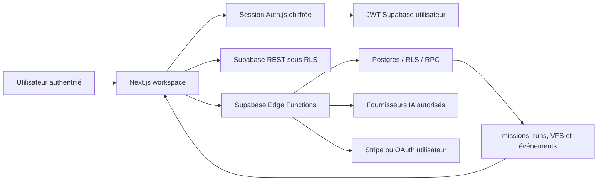

# Architecture V1 — Idealy

> **Objet.** Ce document décrit l’architecture réellement visée par la branche `feat/idealy-live-backend`. Il ne transforme pas une preuve de build, de paiement ou d’OAuth en preuve de production. Les éléments marqués **à vérifier** nécessitent un smoke test authentifié ou une configuration de compte.

## Vue d’ensemble

Idealy est un workspace Next.js dont les données métier et l’autorisation sont portées par **Supabase**. Next.js assure l’interface, la session web et les proxys applicatifs ; les Edge Functions constituent la frontière d’exécution pour l’IA, les missions, les intégrations et les paiements. L’historique du template dans `lib/db` reste un cache de conversation et d’artefacts hérités : il ne doit pas devenir une deuxième source d’autorité pour une mission, un crédit, un paiement ou une intégration.

## Sources d’autorité

| Domaine | Source canonique | Rôle de Next.js | Règle de sécurité |
|---|---|---|---|
| Identité produit | Supabase Auth | Auth.js conserve une session serveur et relaie le JWT Supabase, sans l’exposer dans `session.user`. | Ne pas utiliser l’identité locale de `lib/db` pour autoriser une mission ou un paiement. |
| Profil, crédits et plans | Tables Supabase et RPC versionnés | Affichage et proxy authentifié. | Débit, limites et écritures décidés côté serveur/Edge. |
| Mission et plan | `missions`, notamment `brief`, `dna`, `validation`, `way` | Création du brief et affichage du plan. | Toute lecture/écriture est liée à l’utilisateur Supabase par RLS. |
| Runs d’agents | `mission_agent_runs` | Présente un état persistant. | Aucun usage de l’ancienne table non migrée `agent_runs`. |
| VFS et replay | `mission_files`, `mission_file_events`, RPC d’ajout d’événement | Hydrate le canvas et affiche les fichiers cohérents. | Les événements sont séquencés et rattachés à une mission autorisée. |
| Intégrations | `user_integrations`, `integration_credentials`, `integration_oauth_states` | Initie les parcours et affiche leur statut. | Secret chiffré côté serveur, state consommable une seule fois, aucune action externe implicite. |
| Paiement | Stripe et enregistrements Supabase mis à jour par webhook signé | Affiche l’état et lance uniquement les parcours Stripe autorisés. | Les prix et l’état final ne viennent jamais du navigateur. |

Les routes, fonctions et contrats qui matérialisent cette répartition sont les références techniques de cette V1. [1] [2] [3]

## Parcours de mission

Une conversation ou une idéation ne crée pas de mission. Lorsqu’une intention `EXECUTION` est classifiée, Next crée une mission `draft`, demande un plan borné et enregistre ce plan dans `missions.dna`. Le workspace demande ensuite explicitement **Run squad** avec une clé d’idempotence. L’orchestrateur crée les trois runs persistants — `architect`, `builder`, `reviewer` — puis écrit les événements et les fichiers résultants. Le `reviewer` applique un préflight structurel avant l’état `ready` ou `needs-fix`.

> Le runtime V1 lit et rejoue de vrais événements persistés ; il n’est **pas** une file de jobs durable ni un système WebSocket d’agents autonomes. Les délais de l’orchestrateur donnent de la lisibilité à une exécution synchrone et ne doivent pas être présentés comme un worker persistant.

| Étape | Écriture persistée | Ce qui est montré | Ce qui est interdit |
|---|---|---|---|
| Planification | `missions.dna.plan` | Intention, périmètre et agents proposés | Publication, connecteur, secret, exécution non confirmée. |
| Architecte | `mission_agent_runs`, événements `agent_*` | Plan réutilisé ou produit | Sortie externe et résultat inventé. |
| Builder | Runs, `mission_files`, événements VFS | Fichiers reçus, sauvegardés puis cohérents | Afficher un canvas comme prêt avant cohérence minimale. |
| Reviewer | Run, validation structurelle et événements | Risques, tests manquants et prochain pas | Modifier des fichiers ou publier. |

Le contrat du flux est maintenu dans l’orchestrateur et les tests associés. [4] [5]

## Voix d’agents et avatars

Le registre de production définit quatre voies — Professionnel, Ninja, Hunter et Mage — sous forme de **profils originaux** : tonalité, style de décision, trois opérateurs et interdictions explicites. Les rôles fonctionnels restent Architecte, Builder et Reviewer. La voie est enregistrée sur la mission et relayée dans la planification puis dans l’orchestrateur.

Les avatars fournis par le créateur restent réservés au contexte de démonstration. Ils ne constituent ni une preuve d’identité d’agent, ni un prompt de production. Aucun prompt de production ne doit imiter, citer ou revendiquer un personnage, une voix ou une affiliation de franchise existante. [6]

## Frontières HTTP et Edge

| Surface | Entrée | Protection actuelle | Sortie / limite |
|---|---|---|---|
| `/api/chat` | Message validé, session et anti-bot | Limites de texte, de parties et de liste ; contrôle de chat local pour l’historique. | Utilise le backend Idealy uniquement pour les parcours configurés. |
| `/api/idealy/missions/:id/squad` | UUID de mission et clé d’idempotence | Session Next avec JWT Supabase ; autorisation de mission répétée dans l’Edge Function. | Réponse non mise en cache de l’orchestrateur. |
| `/api/idealy/process-ai-request` | Bearer explicite ou session | Le bearer est requis ; l’`apikey` de Supabase vient uniquement de la configuration serveur. | L’Edge Function applique les limites fournisseur et crédits. |
| `/api/files/upload` | JPEG/PNG ≤ 5 Mo | Session requise et chemin public isolé par utilisateur/UUID. | Les fichiers sont publics par conception : jamais de données sensibles. |
| `process-ai-request` | Prompt/plan/run | JWT, limite de débit, crédits, allowlist de fournisseurs et VFS structuré. | Disponibilité d’un fournisseur à vérifier en environnement réel. |
| `orchestrate-mission` | Mission + idempotence | Ownership, idempotence, runs, validation persistés et directives de voix originales. | Version v3 `ACTIVE` avec JWT, le 25 août 2026. |
| `github-export` | Mission + confirmation | Confirmation one-shot liée au digest et à l’intégration. | OAuth GitHub réel non certifié. |
| Stripe | JWT, origine fixe et webhook signé | CORS strict, retours fixes, erreurs génériques et idempotence checkout. | Checkout test réel à effectuer. |

Les protections de facturation et les gardes des connecteurs partagés sont suivis dans le registre V1. [7]

## Connecteurs et actions externes

Les écritures externes nécessitent une confirmation explicite et un jeton rattaché à l’utilisateur. GitHub dispose du parcours de confirmation avant export ; son OAuth reste limité par une configuration et des tests à effectuer. Les fonctions Vercel et les outils de conception sont volontairement désactivés en V1, plutôt que d’utiliser un jeton serveur partagé ou une génération non débitée.

| Intégration | État | Condition avant activation publique |
|---|---|---|
| GitHub | Parcours OAuth et export préparés, non smoke-testés. | Scopes réduits, test utilisateur, révocation et stratégie d’expiration. |
| Google Drive | Catalogue/documentation seulement. | OAuth utilisateur, clé chiffrée, callback et test de révocation. |
| Vercel | Désactivé par garde 503 authentifiée. | OAuth individuel, confirmation persistante et contrôle de publication. |
| Outils de conception | Désactivés par garde 503 authentifiée. | Mission, débit, crédits, idempotence et politique fournisseur. |

## Références

[1]: [Adaptateur Next–Supabase](../lib/idealy/backend-adapter.ts)
[2]: [Schéma et migrations Supabase](../supabase/migrations/)
[3]: [Architecture d’identité existante](identity-architecture.md)
[4]: [Orchestrateur de mission](../supabase/functions/orchestrate-mission/index.ts)
[5]: [Contrat de l’escouade](../scripts/test-mission-squad-contract.mjs)
[6]: [Registre de personas V1](../lib/idealy/agent-personas.ts)
[7]: [Registre de sécurité V1](v1-security-readiness.md)
